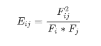

# CoMatrix

### 基本思路

> 构建共现矩阵，我一个基本思路是先根据所有的目标对象构建一个单位矩阵，然后对目标对象的共现情况进行统计、计算，将相应的结果覆盖到对应的矩阵元素即可。对于这种矩阵来说，矩阵的索引、列名使用对应的目标对象的名称会比较方便，因而想到了使用Python中的Pandas来构建矩阵。

### 目标对象统计

> 以作者共现为例。首先对所有合作者的基本情况进行统计，分别构建一个字典统计所有作者单独出现的次数和一个字典统计所有作者两两出现的次数。

- 将所有的合作者名字放入一个列表，以逗号隔开。
- 单个作者出现的频次，按照一般频次统计的方法，判断该对象是否在字典中，不在则对应的value初始化为1，在则value加1。
- 确定当前作者的合作者，目前的一个基本想法是遍历合作者样本，对于每一个作者来说，其合作者是排在他后面的所有作者。于是复制一个样本，每次遍历时去掉第一个也就是当前的作者，那么这个复制样本中所有的作者即为当前作者的合作者。（这个思路其实也是一个组合算法，不知道还有没有优化的方法😔，，还请指点）
- 将这两个合作者以逗号连接，用同样的方法统计频次。但是要注意一个问题，每个样本中两个作者的顺序可能不一致，因此要进行判断，统一顺序。

```python
def authors_stat(co_authors_list):
    au_dict = {}  # 单个作者频次统计
    au_group = {}  # 两两作者合作
    for authors in co_authors_list:
        authors = authors.split(',')  # 按照逗号分开每个作者
        authors_co = authors  # 合作者构建一个复制样本
        for au in authors:
            # 统计单个作者出现的频次
            if au not in au_dict:
                au_dict[au] = 1
            else:
                au_dict[au] += 1
            # 统计合作的频次
            authors_co = authors_co[1:]  # 去掉当前作者
            for au_c in authors_co:
                if au > au_c:
                    au, au_c = au_c, au  # 保持两个作者名字顺序一致
                co_au = au+','+au_c  # 将两个作者合并起来，依然以逗号隔开
                if co_au not in au_group:
                    au_group[co_au] = 1
                else:
                    au_group[co_au] += 1
    return au_group, au_dict
```

### 构建单位矩阵

利用Pandas，以作者名为索引和列表，构建一个单位矩阵：

```python
import pandas as pd
import numpy as np
au_list = list(au_dict.keys())  # 取出所有单个作者
matrix = pd.DataFrame(np.identity(len(au_list)), columns=au_list, index=au_list)
```

### 共现系数计算

共现矩阵中的元素采用Equivalence系数进行归一化，公式如下：



其中，Eij为共现矩阵元素的值，Fij为两个目标对象i和j共现的字数，Fi为目标对象i出现的总频次，Fj为目标对象j出现的总频次。

```python
def generate_matrix(au_group, matrix):
    for key, value in au_group.items():
        A = key.split(',')[0]
        B = key.split(',')[1]
        Fi = au_dict[A]
        Fj = au_dict[B]
        Eij = value*value/(Fi*Fj)
        #按照作者进行索引，更新矩阵
        matrix.ix[A, B] = Eij
        matrix.ix[B, A] = Eij
    return matrix
```

以上。